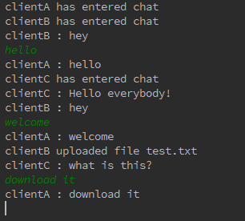
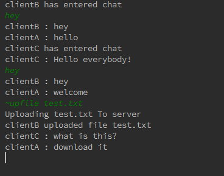
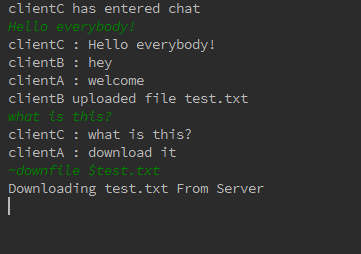
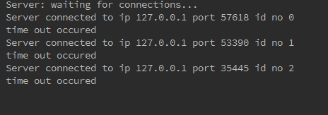

# EROOM
A multithreaded real-time chat room server where clients can connect, chat and share files using reliable UDP connections.

TO DO:
------
* Add Private messages
* Add channels (public)
* Add Private channels
* Add more commands

Sample Screenshots:
------------------
CLIENTA:

CLIENTB:

CLIENTC:

SERVER:

